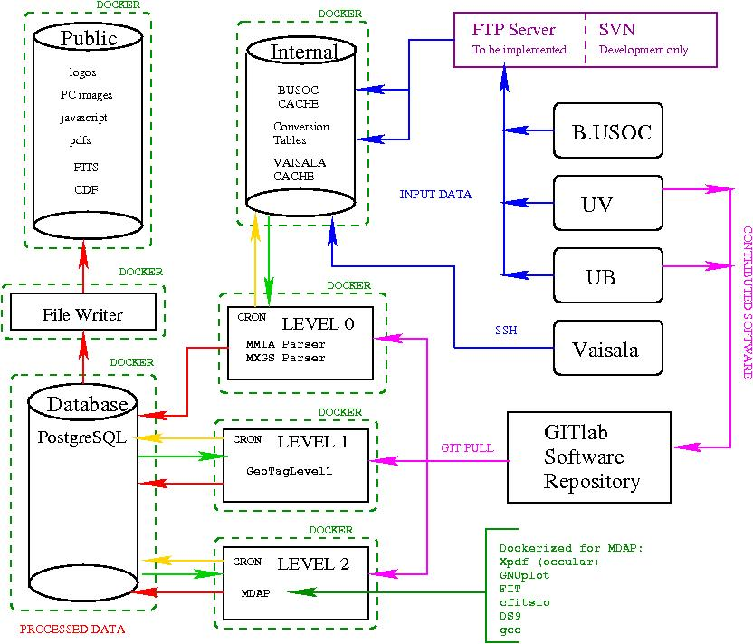
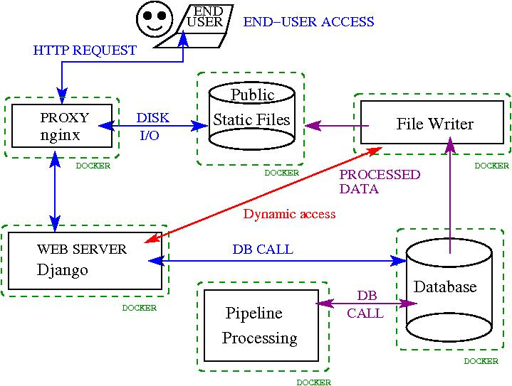
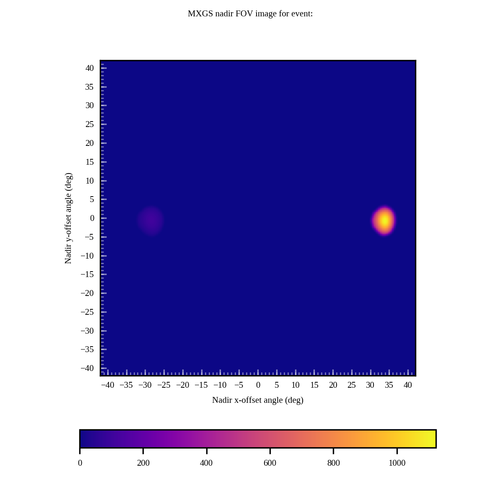
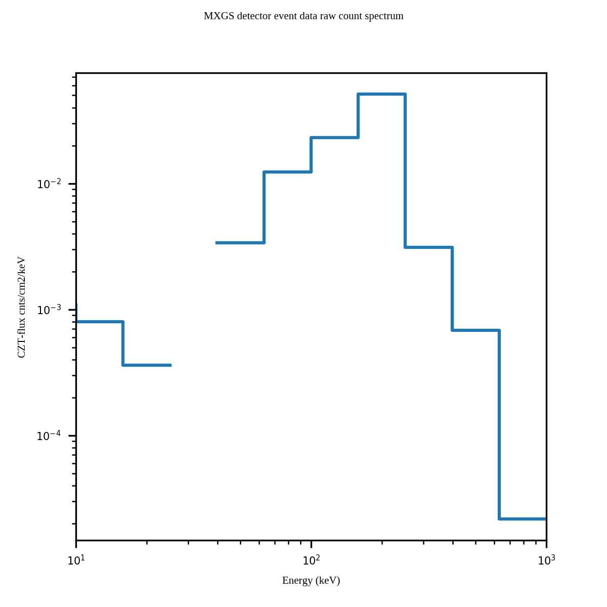
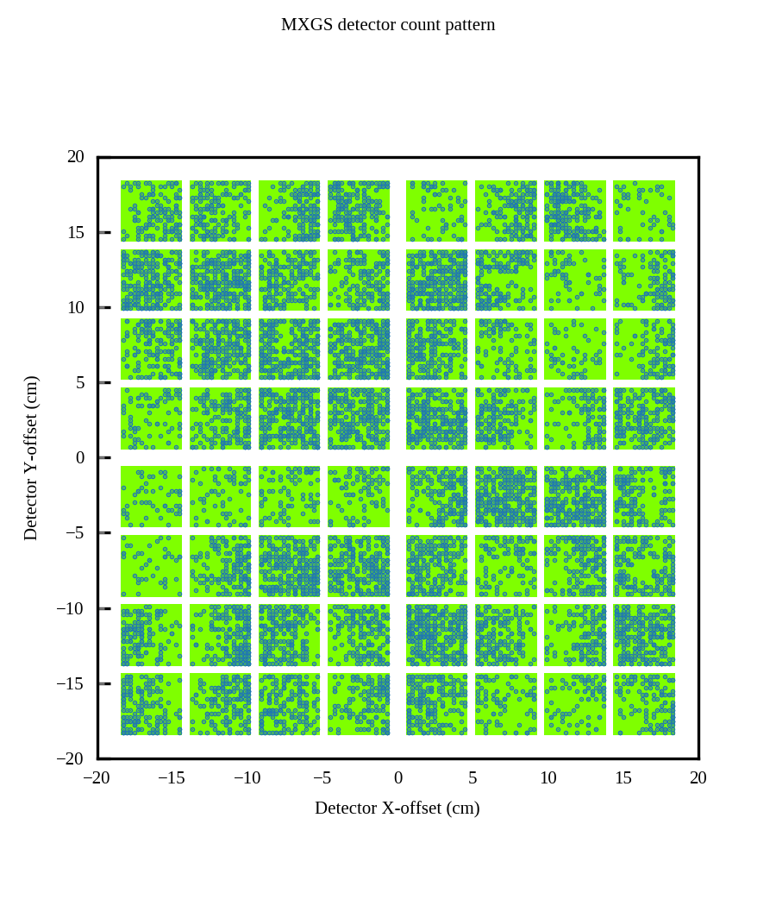

## ASDC Pipeline Software Structure
Gareth Murphy

DTU Space

28-08-2017

---

### ASDC pipeline 
- The ASDC pipeline software is written in Python 3.5
- MDAP (MXGS Data Analysis Program) written in C++ (Paul Connell)
- UB software contributed in Matlab
- Telemetry datatypes are implemented as Django models


---
?image=assets/FlowOverview.jpg&size=contain


---

---

---


---
### Illustrative example of telemetry type

```
class MXGSTGFObservation(ASIMBase):
    observation_id = models.IntegerField('Observation ID')
    utc_year = models.PositiveSmallIntegerField('UTC year')
    utc_seconds = models.PositiveIntegerField('UTC seconds')
    utc_msec = models.PositiveSmallIntegerField('UTC msec')
    tcp_count_dhpu = models.PositiveIntegerField()
    tcp_count_dpu = models.PositiveIntegerField()
    dpu_count = models.PositiveIntegerField()
    dpu_count_prereset = models.IntegerField()
    dau_bgo_1_int_tmon_chan1 = models.PositiveSmallIntegerField()
    dau_bgo_1_int_tmon_chan2 = models.PositiveSmallIntegerField()
    dau_bgo_1_int_tmon_chan3 = models.PositiveSmallIntegerField()
    dau_bgo_1_int_tmon_chan4 = models.PositiveSmallIntegerField()
    dau_bgo_2_int_tmon_chan1 = models.PositiveSmallIntegerField()
    dau_bgo_2_int_tmon_chan2 = models.PositiveSmallIntegerField()
    dau_bgo_2_int_tmon_chan3 = models.PositiveSmallIntegerField()
    dau_bgo_2_int_tmon_chan4 = models.PositiveSmallIntegerField()
    dau_bgo_3_int_tmon_chan1 = models.PositiveSmallIntegerField()
```
---
### Structure

-  The pipeline is divided into three processing levels
- Level 0 - Reconstructed, unprocessed instrument data @ full resolution
- Level 1 - Reconstructed instrument data, time referenced, including calibration & georeferencing metadata
- Level 2 - Derived environmental variables at same resolution and location as Level I. 
- Each level is subdivided into packages which map to SRD

---
### Level 0

---

### Example software requirement

- 3.1.4 The ASDC shall output all chosen data formats for all processing levels
The formats are: FITS format [4] and NASA CDF format [3].
-  Implementation: Filewriter

---
### Implementation:
```
class CDFWriter(FilewriterBase):
    def write_cdf(self, my_tgf):
        self.observation_dict = model_to_dict(my_tgf)
        self.set_file_name()
        self.write_dict_to_cdf(self.observation_dict)

    def write_dict_to_cdf(self, my_tgf_dict):
        self.set_file_name()
        print(self.file_name)
        self.remove_file()
        pycdf.lib.set_backward(False)
        cdf = pycdf.CDF(self.file_name, '')
        for key, val in my_tgf_dict.items():
            if key not in self.invalid_keys:
                if val is None:
                    val = [0]
                cdf_type = self.determine_cdftype(key, val)

                if isinstance(val, list):
                    cdf_type = self.determine_cdftype(key, max(val))

                if cdf_type is not None:
                    print(cdf_type)
                    cdf.new(key, val, recVary=False, type=cdf_type)
                else:
                    cdf.new(key, val, recVary=False)

        cdf.attrs['Author'] = 'Gareth Murphy <gmurphy@space.dtu.dk>'
        cdf.attrs['CreateDate'] = datetime.datetime.now()
        # print(cdf.attrs)
        cdf.close()
```


---
### Known bugs

- CDF library uses  smallest available type, depending on value
- Fix: manually alter type

---
### Example Requirement: TGF Parser

- 3.1.1 The ASDC shall archive and process all data packets received from the B.USOC
The format will be in the CCSDS space telemetry packet format [2].
- Implementation: MXGSTGFObservationParser()
---
```
class MXGSTGFObservationParserText():
    def __init__(self):
        self.address = MXGSAddress()

    def unpack_and_sort(self, bgo_format, bgo_data, time_of_photon_hit):
        bit_formatted_bgo_list = [BitArray(bin=y) for y in bgo_data]
        unpack_tuple_list = (
            [x.unpack(bgo_format) for x in bit_formatted_bgo_list])
        unpack_sort = sorted(unpack_tuple_list, key=lambda x: x[time_of_photon_hit])
        return unpack_sort

    def parse(self, masterdata, obsid):
        mxgstgfobservation = MXGSTGFObservation()
        x = iter(masterdata)


        mxgstgfobservation.observation_id = int(obsid, 16)
        mxgstgfobservation.utc_year = hex2int(next(x))
        mxgstgfobservation.utc_msec = hex2int(next(x))
        mxgstgfobservation.utc_seconds = hex2int(next(x) + next(x))
        mxgstgfobservation.tcp_count_dhpu = hex2int(next(x) + next(x))
        mxgstgfobservation.tcp_count_dpu = hex2int(next(x) + next(x))
        mxgstgfobservation.dpu_count = hex2int(next(x) + next(x))
        mxgstgfobservation.dpu_count_prereset = hex2int(next(x) + next(x))
        mxgstgfobservation.dau_bgo_1_int_tmon_chan1 = hex2int(next(x))
        mxgstgfobservation.dau_bgo_1_int_tmon_chan2 = hex2int(next(x))
        mxgstgfobservation.dau_bgo_1_int_tmon_chan3 = hex2int(next(x))
        mxgstgfobservation.dau_bgo_1_int_tmon_chan4 = hex2int(next(x))
        mxgstgfobservation.dau_bgo_2_int_tmon_chan1 = hex2int(next(x))
        mxgstgfobservation.dau_bgo_2_int_tmon_chan2 = hex2int(next(x))
        mxgstgfobservation.dau_bgo_2_int_tmon_chan3 = hex2int(next(x))
        mxgstgfobservation.dau_bgo_2_int_tmon_chan4 = hex2int(next(x))
        mxgstgfobservation.dau_bgo_3_int_tmon_chan1 = hex2int(next(x))
        mxgstgfobservation.dau_bgo_3_int_tmon_chan2 = hex2int(next(x))
        mxgstgfobservation.dau_bgo_3_int_tmon_chan3 = hex2int(next(x))
        mxgstgfobservation.dau_bgo_3_int_tmon_chan4 = hex2int(next(x))
        mxgstgfobservation.dau_bgo_4_int_tmon_chan1 = hex2int(next(x))
        mxgstgfobservation.dau_bgo_4_int_tmon_chan2 = hex2int(next(x))
        mxgstgfobservation.dau_bgo_4_int_tmon_chan3 = hex2int(next(x))
        mxgstgfobservation.dau_bgo_4_int_tmon_chan4 = hex2int(next(x))
        mxgstgfobservation.led_short_win_lr_pulse_height = hex2int(next(x))
        mxgstgfobservation.led_short_win_upr_pulse_height = hex2int(next(x))
        mxgstgfobservation.led_long_win_lr_pulse_height = hex2int(next(x))
        mxgstgfobservation.led_long_win_upr_pulse_height = hex2int(next(x))
        mxgstgfobservation.hed_short_win_lr_pulse_height = hex2int(next(x))
        mxgstgfobservation.hed_short_win_upr_pulse_height = hex2int(next(x))
        mxgstgfobservation.hed_long_win_lr_pulse_height = hex2int(next(x))
        mxgstgfobservation.hed_long_win_upr_pulse_height = hex2int(next(x))

        shortlongwin = next(x)
        mxgstgfobservation.led_short_win_anticoin_time = hex2int(shortlongwin[0:2])
        mxgstgfobservation.led_long_win_anticoin_time = hex2int(shortlongwin[2:4])
        shortlongwin = next(x)
        mxgstgfobservation.hed_short_win_anticoin_time = hex2int(shortlongwin[0:2])
        mxgstgfobservation.hed_long_win_anticoin_time = hex2int(shortlongwin[2:4])

        bits = next(x)

        a = BitArray('0x' + bits)
        mxgstgfobservation.led_short_win_flag1 = a[0]
        mxgstgfobservation.led_short_win_flag2 = a[1]
        mxgstgfobservation.led_short_win_flag3 = a[2]
        mxgstgfobservation.led_long_win_flag = a[3]
        mxgstgfobservation.hed_short_win_flag1 = a[4]
        mxgstgfobservation.hed_short_win_flag2 = a[5]
        mxgstgfobservation.hed_short_win_flag3 = a[6]
        mxgstgfobservation.hed_long_win_flag = a[7]

        mxgstgfobservation.trig_mmia_enabled = a[8]
        mxgstgfobservation.trig_mmia_recd = a[9]
```
---
### Known bugs:
- Time order can be non-sequential
- Most significant digit is missing from time
---
### Level 1
---


---
### level 1 structure
```
level1
├── level1/AddAttitudeData
│   └── level1/AddAttitudeData/AddAttitudeData.py
├── level1/ApplyCalibrationRoutines
│   └── level1/ApplyCalibrationRoutines/LEDCalibrationMatrix.py
├── level1/CleanForInstrumentIssues
│   ├── level1/CleanForInstrumentIssues/AcceptedCountsFiltering.py
│   ├── level1/CleanForInstrumentIssues/CleanForInstrumentIssues.py
│   ├── level1/CleanForInstrumentIssues/CorrectTimeOrdering.py
│   ├── level1/CleanForInstrumentIssues/HotPixelFilter.py
│   └── level1/CleanForInstrumentIssues/TriggerAlgorithm.py
├── level1/ConvertToPhysicalValues
│   ├── level1/ConvertToPhysicalValues/mmia
│   │   ├── level1/ConvertToPhysicalValues/mmia/MMIAHousekeepingUnitConverter.py
│   │   └── level1/ConvertToPhysicalValues/mmia/MMIAPhotonFlux.py
│   └── level1/ConvertToPhysicalValues/mxgs
│       ├── level1/ConvertToPhysicalValues/mxgs/AbstractUnitConverter.py
│       ├── level1/ConvertToPhysicalValues/mxgs/MXGSInstrumentSummaryHousekeepingUnitConversion.py
│       ├── level1/ConvertToPhysicalValues/mxgs/MXGSTGFObservationUnitConversion.py
│       ├── level1/ConvertToPhysicalValues/mxgs/MXGSUnitConversion.py
│       ├── level1/ConvertToPhysicalValues/mxgs/MXGSUnitConverterFactory.py
│       └── level1/ConvertToPhysicalValues/mxgs/convert_generator.py
├── level1/EstimateTriggerEventType
│   └── level1/EstimateTriggerEventType/EstimateTriggerEventType.py
├── level1/GetCalibrationRoutines
│   └── level1/GetCalibrationRoutines/GetCalibrationRoutines.py
├── level1/OutputLevel1Data
│   └── level1/OutputLevel1Data/OutputLevel1Data.py
├── level1/SearchUndetectedEventsMMIA
├── level1/SearchUndetectedTriggers
│   └── level1/SearchUndetectedTriggers/SearchUndetectedTriggers.py
├── level1/TimeCorrelateMXGSMMIA
├── level1/geotag
│   ├── level1/geotag/GeoTag.py
│   └── level1/geotag/file_rename.py
├── level1/mmia
│   └── level1/mmia/MMIA_ORBIT_FOV
│       ├── level1/mmia/MMIA_ORBIT_FOV/CHU_Pos.py
│       ├── level1/mmia/MMIA_ORBIT_FOV/CHU_Pos_Test.py
│       ├── level1/mmia/MMIA_ORBIT_FOV/ISS_Orbit_File.py
│       ├── level1/mmia/MMIA_ORBIT_FOV/ISS_Orbit_Predict.py
│       ├── level1/mmia/MMIA_ORBIT_FOV/MMIA_YPR_Error.py
│       ├── level1/mmia/MMIA_ORBIT_FOV/MMIA_YPR_Test.py
│       ├── level1/mmia/MMIA_ORBIT_FOV/MXGS_Pos.py
│       └── level1/mmia/MMIA_ORBIT_FOV/MXGS_Pos_Test.py
├── level1/sample_detector_counts.py
├── level1/sanity_check
│   ├── level1/sanity_check/MXGSMonitoredHousekeepingSanityCheck.py
│   └── level1/sanity_check/MXGSSanityCheckFactory.py
└── level1/test
    ├── level1/test/test_bin_data.py
    ├── level1/test/test_calibration.py
    ├── level1/test/test_file_rename.py
    ├── level1/test/test_onboard_processing.py
    ├── level1/test/test_plot_tgf_spectrum.py
    ├── level1/test/test_time_correlate.py
    └── level1/test/test_unit_conversion.py
```

---
### Example requirement
- Unit conversion

---
```
class MXGSUnitConversion(object):
    def __init__(self):
        self.temp_add_50 = -50.02
        self.temp_mult_50 = 0.510
        self.temp_add_60 = -60.0
        self.temp_mult_60 = 0.463
        self.bgo_temp_add = -273.15
        self.bgo_temp_mult = 830.6
        self.check_if_tables_populated()
        c_temp_3 = MXGSCTemp3.objects.latest('latest_datetime')
        c_temp_2 = MXGSCTemp2.objects.latest('latest_datetime')
        c_temp_1 = MXGSCTemp1.objects.latest('latest_datetime')

        self.c_temp_mxgs_3_raw = c_temp_3.raw
        self.c_temp_mxgs_3_temp = c_temp_3.temperature
        self.c_temp_mxgs_2_raw = c_temp_2.raw
        self.c_temp_mxgs_2_temp = c_temp_2.temperature
        self.c_temp_mxgs_1_raw = c_temp_1.raw
        self.c_temp_mxgs_1_temp = c_temp_1.temperature

    def check_if_tables_populated(self):
        if MXGSCTemp3.objects.all().exists():
            pass
        else:
            naive_datetime = datetime.datetime.now()
            datetime_with_tz = naive_datetime.replace(tzinfo=pytz.UTC)
            MXGSCTemp3.objects.create(latest_datetime=datetime_with_tz,
                                      raw=[4003, 3903, 3728, 3448, 3051, 2558, 2029, 1534, 1119, 800, 567, 402, 287],
                                      temperature=[-60.04, -49.97, -39.99, -29.99, -20.01, -10.00, 0.01, 10.00, 20.00,
                                                   29.99, 39.99, 50.00, 60.01])
            MXGSCTemp2.objects.create(latest_datetime=datetime.datetime.now(),
                                      raw=[4009, 3936, 3817, 3639, 3387, 3061, 2675, 2258, 1846, 1469, 1147, 885, 679],
                                      temperature=[-49.98, -40.03, -29.97, -20.02, -10.00, 0.00, 10.00, 19.99, 29.99,
                                                   40.01, 50.01, 60.00, 69.98])
            MXGSCTemp1.objects.create(latest_datetime=datetime.datetime.now(),
                                      raw=[3891, 3009, 2936, 2886, 2838],
                                      temperature=[-34.84, 30.59, 37.85, 41.46, 45.06])

    def bgo_temp_convert(self, raw_temp, nref):
        if nref == 0:
            nref = 3103
            print("nref zero -setting to nominal value")
        return self.bgo_temp_add + self.bgo_temp_mult * raw_temp / nref

    def to_celsius_60(self, raw_temperature):
        return self.temp_add_60 + self.temp_mult_60 * raw_temperature

    def to_celsius_50(self, raw_temperature):
        return self.temp_add_50 + self.temp_mult_50 * raw_temperature

    def e1_evap_conversion(self, raw_temperature):
        temperature_in_celsius = numpy.interp(raw_temperature, self.c_temp_mxgs_3_raw, self.c_temp_mxgs_3_temp)
        return temperature_in_celsius

    def e2_thermistor_conversion(self, raw_temperature):
        temperature_in_celsius = numpy.interp(raw_temperature, self.c_temp_mxgs_2_raw, self.c_temp_mxgs_2_temp)
        return temperature_in_celsius

    def e3_fpga_conversion(self, raw_temperature):
        temperature_in_celsius = numpy.interp(raw_temperature, self.c_temp_mxgs_1_raw, self.c_temp_mxgs_1_temp)
        return temperature_in_celsius

```
---
### Improvements

- add conversions for other variables


---
### Level 2
---

---
```
class mdap_dat(object):
    def __init__(self):
        self.xaxisdata = 0
        self.yaxisdata = 0
        self.heads = 0
        self.outname = 0
        self.comments = 0
        self.units = 0
        self.plottitle = 0
        self.xtitle = 0
        self.ytitle = 0
        self.xsize = 4
        self.ysize = 3
        self.scidata = 0
        self.dmsize = 4.1

    def get_data_from_fitsfile(self, filename):
        hdulist = fits.open(filename)
        hdulist.info()
        self.scidata = hdulist[0].data
        regx = re.compile('fits\\b')
        self.outname = regx.sub('png', filename)

    def plot_fits_image(self):
        # print hdulist[0].header
        self.figure_config()
        fig, ax1 = self.figure_setup()
        im = plt.imshow(self.scidata, extent=[-42, 42, -42, 42], cmap=cm.plasma)

        self.set_tick_marks(ax1)

        for tick in ax1.get_yticklines():
            tick.set_color('white')
            tick.set_alpha(0.5)
        self.plottitle = 'MXGS nadir FOV image for event: '
        labelstr = 'Nadir %s-offset angle (deg)'
        self.ytitle = labelstr % 'y'
        self.xtitle = labelstr % 'x'
        plt.colorbar(im, fraction=0.046, pad=0.14, orientation='horizontal')
        self.figure_wrapup(fig, ax1)

    def set_tick_marks(self, ax1):
        majorLocator = MultipleLocator(5)
        minorLocator = MultipleLocator(1)
        ax1.xaxis.set_major_locator(majorLocator)
        ax1.xaxis.set_minor_locator(minorLocator)
        ax1.yaxis.set_major_locator(majorLocator)
        ax1.yaxis.set_minor_locator(minorLocator)
        ax1.get_yaxis().set_tick_params(direction='in', which='both')
        ax1.get_xaxis().set_tick_params(direction='in', which='both', color='black')
        for tick in ax1.get_xticklines():
            tick.set_color('white')
            tick.set_alpha(0.5)
        for minortick in ax1.xaxis.get_minorticklines():
            minortick.set_color('white')
            minortick.set_alpha(0.5)
        for minortick in ax1.yaxis.get_minorticklines():
            minortick.set_color('white')
            minortick.set_alpha(0.5)
```
---

---

---

---
### Known bugs

- bash script aliases need to be available
---
### Docker 
- Pipeline runs on lightweight containers
- Software installation requirements stored as Dockerfiles


```
FROM ubuntu:16.04
MAINTAINER Gareth Murphy <gmurphy@space.dtu.dk>
RUN mkdir /code
WORKDIR /code
RUN apt-get update && apt-get install -y \
        cron \
        curl \
        gfortran \
        libncurses5-dev \
        libpq-dev \
        python3-astropy \
        python3-matplotlib \
        python3-numpy \
        python3-pip \
        python3-scipy \
        python3-ephem
COPY requirements.txt /code/
```

---
## Using the docker containers

To start the docker project you must first clone the repository

```
git clone https://gitlab.spacecenter.dk/asdc/asdc.git
```

```
docker-compose up --build
```

To log into individual container use the command 
```
docker exec -it <CONTAINER_NAME> /bin/bash 
```


where ```<CONTAINER_NAME>``` is one of:


asdc_level0_1 , asdc_level1_1 , asdc_level3_1 , asdc_web_1 , asdc_db_1 , asdc_filewriter_1
---
E.g. to run migrations use:

```
docker exec -it asdc_web_1 /bin/bash 
```

Then run

```
./manage.py makemigrations
./manage.py migrate
```

To access level0 scripts and functions
```
docker exec -it asdc_level0_1 /bin/bash 
 ```

Similarly for level1 
```
docker exec -it asdc_level1_1  /bin/bash 
```
---
1. Start a shell session in level0 container
```
docker exec -it dtuspaceasdcbuild_level0_1 /bin/bash
```

2. Run the level0 script
```
./RunLevel0
```
(To restore Pacts data run ./RunLevel0Pacts)

3. Start a shell session in level1 container
```
docker exec -it dtuspaceasdcbuild_level1_1 /bin/bash
```

4. Run the level1 script
```
./RunLevel1
```


---

### TLE forms

- TLE community can submit observations


---
### Improvements

- Need to add on-board and on-ground processing from CE TN
- 
---
### Known Bugs

- Fails when unexpected packet is received
- Packet sequences with gaps are not processed

---
### Thank you
